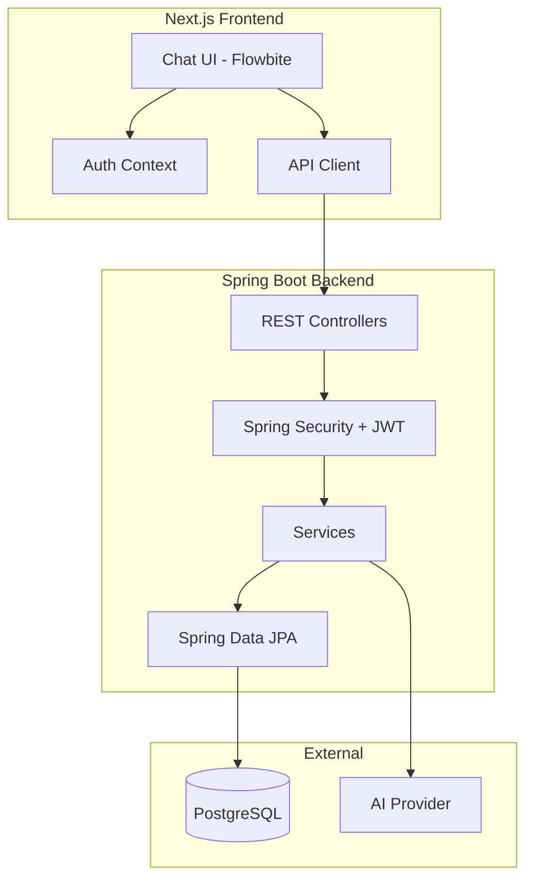
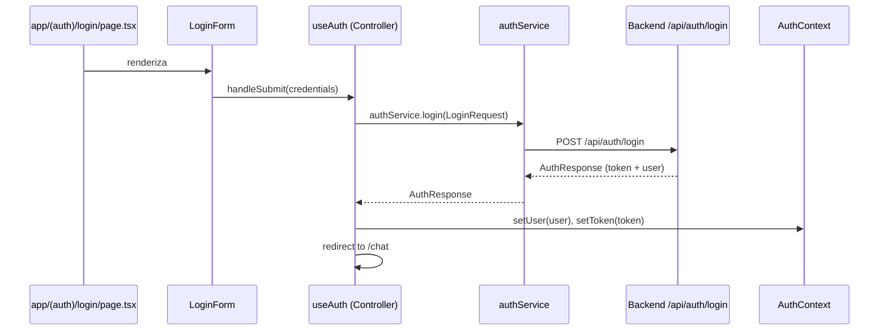
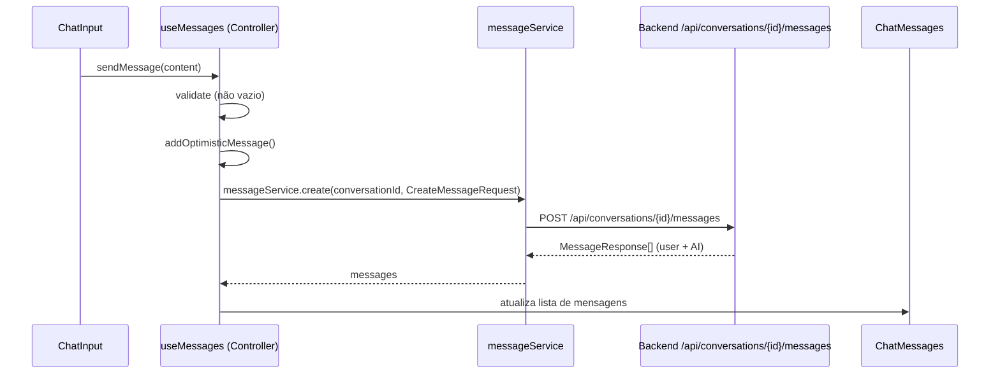

# Design Document

## Overview

Este documento descreve a arquitetura e design técnico da interface de chat com IA. O sistema será composto por um frontend Next.js com componentes Flowbite e um backend Java Spring Boot, comunicando-se via REST API com autenticação JWT.

## Architecture



### Tech Stack

**Frontend:**
- Next.js 14 (App Router)
- TypeScript
- Flowbite React
- Tailwind CSS
- Axios para HTTP requests

**Backend:**
- Java 8
- Spring Boot 2.7.x
- Spring Security com JWT
- Spring Data JPA
- PostgreSQL
- Bean Validation (javax.validation)
- Lombok

## Components and Interfaces

### Frontend Architecture (Feature-Based)

A arquitetura frontend segue o padrão Feature-Based, espelhando as features do backend Spring Boot. Cada feature é auto-contida com seus próprios componentes, hooks (controllers), services e DTOs.

```
src/
├── app/                              # Apenas rotas e composição (sem lógica)
│   ├── (auth)/
│   │   ├── login/page.tsx           # Compõe LoginForm
│   │   └── register/page.tsx        # Compõe RegisterForm
│   ├── (chat)/
│   │   └── page.tsx                 # Compõe ChatLayout
│   ├── layout.tsx
│   └── providers.tsx                # Providers globais
│
├── features/
│   ├── auth/                        # Feature: Autenticação
│   │   ├── components/
│   │   │   ├── LoginForm.tsx
│   │   │   └── RegisterForm.tsx
│   │   ├── hooks/
│   │   │   └── useAuth.ts           # Controller: orquestra login/register/logout
│   │   ├── services/
│   │   │   └── authService.ts       # 1:1 com AuthController do backend
│   │   ├── dto/
│   │   │   ├── request.ts           # LoginRequest, RegisterRequest
│   │   │   └── response.ts          # AuthResponse
│   │   ├── context/
│   │   │   └── AuthContext.tsx      # Estado global de auth
│   │   └── index.ts                 # Public exports
│   │
│   ├── conversations/               # Feature: Conversas
│   │   ├── components/
│   │   │   ├── ChatSidebar.tsx
│   │   │   ├── ConversationList.tsx
│   │   │   └── ConversationItem.tsx
│   │   ├── hooks/
│   │   │   └── useConversations.ts  # Controller: CRUD de conversas
│   │   ├── services/
│   │   │   └── conversationService.ts # 1:1 com ConversationController
│   │   ├── dto/
│   │   │   ├── request.ts           # CreateConversationRequest, UpdateConversationRequest
│   │   │   └── response.ts          # ConversationResponse, PaginatedResponse
│   │   └── index.ts
│   │
│   ├── messages/                    # Feature: Mensagens
│   │   ├── components/
│   │   │   ├── ChatMessages.tsx
│   │   │   ├── MessageBubble.tsx
│   │   │   └── ChatInput.tsx
│   │   ├── hooks/
│   │   │   └── useMessages.ts       # Controller: envio/recebimento de mensagens
│   │   ├── services/
│   │   │   └── messageService.ts    # 1:1 com MessageController
│   │   ├── dto/
│   │   │   ├── request.ts           # CreateMessageRequest
│   │   │   └── response.ts          # MessageResponse
│   │   └── index.ts
│   │
│   └── chat/                        # Feature: Composição do Chat
│       ├── components/
│       │   └── ChatLayout.tsx       # Layout principal integrando sidebar + messages
│       ├── hooks/
│       │   └── useChat.ts           # Controller: orquestra conversa ativa
│       └── index.ts
│
├── shared/                          # Utilitários compartilhados
│   ├── components/
│   │   ├── LoadingSpinner.tsx
│   │   └── ErrorBoundary.tsx
│   ├── lib/
│   │   └── httpClient.ts            # Axios instance configurado
│   └── utils/
│       └── formatDate.ts
│
└── config/
    └── env.ts                       # Variáveis de ambiente
```

### Responsabilidades por Camada

| Camada | Responsabilidade | Exemplo |
|--------|------------------|---------|
| **app/** | Rotas e composição de páginas | `page.tsx` importa e renderiza componentes |
| **components/** | UI pura, recebe props, emite eventos | `MessageBubble` renderiza uma mensagem |
| **hooks/** | Controllers - orquestração de fluxo e estado | `useAuth` gerencia login/logout/estado |
| **services/** | Comunicação HTTP, 1:1 com backend | `authService.login()` chama `/api/auth/login` |
| **dto/** | Tipos de request/response alinhados ao backend | `LoginRequest`, `AuthResponse` |
| **context/** | Estado global da feature (quando necessário) | `AuthContext` mantém user logado |

### Mapa Frontend ↔ Backend

| Frontend Feature | Backend Controller | Endpoints |
|-----------------|-------------------|-----------|
| `features/auth` | `AuthController` | `/api/auth/*` |
| `features/conversations` | `ConversationController` | `/api/conversations/*` |
| `features/messages` | `MessageController` | `/api/conversations/{id}/messages` |

### Exemplo de Fluxo: Login



### Exemplo de Fluxo: Envio de Mensagem



### Backend Structure (Spring Boot)

```
src/main/java/com/chatai/
├── ChatAiApplication.java
├── config/
│   ├── SecurityConfig.java
│   ├── JwtConfig.java
│   └── CorsConfig.java
├── controller/
│   ├── AuthController.java
│   ├── ConversationController.java
│   └── MessageController.java
├── service/
│   ├── UserService.java
│   ├── AuthService.java
│   ├── ConversationService.java
│   ├── MessageService.java
│   └── AiService.java
├── repository/
│   ├── UserRepository.java
│   ├── ConversationRepository.java
│   └── MessageRepository.java
├── entity/
│   ├── User.java
│   ├── Conversation.java
│   └── Message.java
├── dto/
│   ├── request/
│   │   ├── RegisterRequest.java
│   │   ├── LoginRequest.java
│   │   ├── CreateConversationRequest.java
│   │   └── CreateMessageRequest.java
│   └── response/
│       ├── AuthResponse.java
│       ├── ConversationResponse.java
│       ├── MessageResponse.java
│       └── PaginatedResponse.java
├── security/
│   ├── JwtTokenProvider.java
│   ├── JwtAuthenticationFilter.java
│   └── UserDetailsServiceImpl.java
└── exception/
    ├── GlobalExceptionHandler.java
    ├── ResourceNotFoundException.java
    └── ValidationException.java
```

### API Endpoints

| Method | Endpoint | Description |
|--------|----------|-------------|
| POST | /api/auth/register | Registrar novo usuário |
| POST | /api/auth/login | Autenticar usuário |
| POST | /api/auth/logout | Invalidar sessão |
| GET | /api/conversations | Listar conversas do usuário |
| POST | /api/conversations | Criar nova conversa |
| GET | /api/conversations/{id} | Obter conversa com mensagens |
| PATCH | /api/conversations/{id} | Atualizar título da conversa |
| DELETE | /api/conversations/{id} | Deletar conversa |
| GET | /api/conversations/{id}/messages | Listar mensagens da conversa em ordem cronológica |
| POST | /api/conversations/{id}/messages | Enviar mensagem e obter resposta da IA |

## Data Models

### JPA Entities

```java
@Entity
@Table(name = "users")
public class User {
    @Id
    @GeneratedValue(strategy = GenerationType.UUID)
    private String id;
    
    @Column(unique = true, nullable = false)
    private String email;
    
    @Column(nullable = false)
    private String password;
    
    @Column(nullable = false)
    private String name;
    
    @CreationTimestamp
    private LocalDateTime createdAt;
    
    @UpdateTimestamp
    private LocalDateTime updatedAt;
    
    @OneToMany(mappedBy = "user", cascade = CascadeType.ALL, orphanRemoval = true)
    private List<Conversation> conversations;
}

@Entity
@Table(name = "conversations")
public class Conversation {
    @Id
    @GeneratedValue(strategy = GenerationType.UUID)
    private String id;
    
    private String title;
    
    @ManyToOne(fetch = FetchType.LAZY)
    @JoinColumn(name = "user_id", nullable = false)
    private User user;
    
    @OneToMany(mappedBy = "conversation", cascade = CascadeType.ALL, orphanRemoval = true)
    @OrderBy("createdAt ASC")
    private List<Message> messages;
    
    @CreationTimestamp
    private LocalDateTime createdAt;
    
    @UpdateTimestamp
    private LocalDateTime updatedAt;
}

@Entity
@Table(name = "messages")
public class Message {
    @Id
    @GeneratedValue(strategy = GenerationType.UUID)
    private String id;
    
    @Column(columnDefinition = "TEXT", nullable = false)
    private String content;
    
    @Enumerated(EnumType.STRING)
    @Column(nullable = false)
    private MessageRole role;
    
    @ManyToOne(fetch = FetchType.LAZY)
    @JoinColumn(name = "conversation_id", nullable = false)
    private Conversation conversation;
    
    @CreationTimestamp
    private LocalDateTime createdAt;
}

public enum MessageRole {
    USER, ASSISTANT
}
```

### TypeScript DTOs (Frontend - por Feature)

```typescript
// features/auth/dto/request.ts
export interface RegisterRequest {
  email: string;
  password: string;
  name: string;
}

export interface LoginRequest {
  email: string;
  password: string;
}

// features/auth/dto/response.ts
export interface User {
  id: string;
  email: string;
  name: string;
}

export interface AuthResponse {
  accessToken: string;
  user: User;
}

// features/conversations/dto/request.ts
export interface CreateConversationRequest {
  title?: string;
}

export interface UpdateConversationRequest {
  title: string;
}

// features/conversations/dto/response.ts
export interface ConversationResponse {
  id: string;
  title: string | null;
  createdAt: string;
  updatedAt: string;
}

export interface PaginatedResponse<T> {
  data: T[];
  meta: {
    total: number;
    page: number;
    limit: number;
    totalPages: number;
  };
}

// features/messages/dto/request.ts
export interface CreateMessageRequest {
  content: string;
}

// features/messages/dto/response.ts
export type MessageRole = 'USER' | 'ASSISTANT';

export interface MessageResponse {
  id: string;
  content: string;
  role: MessageRole;
  createdAt: string;
}
```


## Correctness Properties

*A property is a characteristic or behavior that should hold true across all valid executions of a system-essentially, a formal statement about what the system should do. Properties serve as the bridge between human-readable specifications and machine-verifiable correctness guarantees.*

### Property 1: Valid registration creates user
*For any* valid registration data (valid email format, password meeting requirements, non-empty name), submitting registration SHALL result in a new user being created with matching email and name.
**Validates: Requirements 1.1**

### Property 2: Invalid registration returns field-specific errors
*For any* registration data with invalid fields, the system SHALL return error messages that specifically identify each invalid field.
**Validates: Requirements 1.2**

### Property 3: Valid credentials return JWT
*For any* registered user with known credentials, submitting those credentials SHALL return a valid JWT token that can be used for authenticated requests.
**Validates: Requirements 1.3**

### Property 4: Invalid credentials return generic error
*For any* login attempt with incorrect credentials, the system SHALL return an error message that does not reveal whether the email or password was incorrect.
**Validates: Requirements 1.4**

### Property 5: Logout invalidates token
*For any* authenticated session, after logout the previously valid token SHALL be rejected on subsequent requests.
**Validates: Requirements 1.5**

### Property 6: Whitespace-only messages are rejected
*For any* string composed entirely of whitespace characters (spaces, tabs, newlines), attempting to send it as a message SHALL be rejected and the conversation state SHALL remain unchanged.
**Validates: Requirements 2.2**

### Property 7: AI errors are handled gracefully
*For any* AI provider error, the system SHALL return a user-friendly error response and maintain the ability to retry the request.
**Validates: Requirements 2.5**

### Property 8: New conversation is empty
*For any* newly created conversation, the conversation SHALL have zero messages and a null or auto-generated title.
**Validates: Requirements 3.1**

### Property 9: Conversation deletion cascades to messages
*For any* conversation with associated messages, deleting the conversation SHALL also delete all associated messages from the database.
**Validates: Requirements 3.3**

### Property 10: Conversation rename persists
*For any* conversation and any new valid title, renaming the conversation SHALL result in the title being updated and persisted.
**Validates: Requirements 3.4**

### Property 11: Message persistence round-trip
*For any* valid message object, serializing to JSON and deserializing back SHALL produce an equivalent message object with the same content, role, and metadata.
**Validates: Requirements 5.4, 5.5**

### Property 12: Messages retrieved in chronological order
*For any* conversation with multiple messages, retrieving the conversation SHALL return messages sorted by creation timestamp in ascending order.
**Validates: Requirements 5.3**

### Property 13: JWT validation guards endpoints
*For any* protected endpoint, requests with invalid or expired JWT tokens SHALL receive a 401 status response.
**Validates: Requirements 6.1, 6.2**

### Property 14: Request validation rejects invalid schemas
*For any* API endpoint with a defined schema, requests with bodies that violate the schema SHALL receive validation error responses.
**Validates: Requirements 6.3**

### Property 15: Pagination metadata is accurate
*For any* paginated response, the metadata (total, page, limit, totalPages) SHALL accurately reflect the actual data in the database.
**Validates: Requirements 6.4**

## Error Handling

### Frontend Error Handling

| Error Type | Handling Strategy |
|------------|-------------------|
| Network Error | Display toast notification, allow retry |
| 401 Unauthorized | Redirect to login, clear auth state |
| 400 Validation | Display field-specific error messages |
| 500 Server Error | Display generic error message |
| AI Provider Error | Display error in chat, allow retry |

### Backend Error Handling (Spring Boot)

```java
@RestControllerAdvice
public class GlobalExceptionHandler {
    
    @ExceptionHandler(MethodArgumentNotValidException.class)
    public ResponseEntity<ErrorResponse> handleValidationErrors(MethodArgumentNotValidException ex) {
        // Return field-specific validation errors
    }
    
    @ExceptionHandler(ResourceNotFoundException.class)
    public ResponseEntity<ErrorResponse> handleNotFound(ResourceNotFoundException ex) {
        // Return 404 with message
    }
    
    @ExceptionHandler(Exception.class)
    public ResponseEntity<ErrorResponse> handleGenericError(Exception ex) {
        // Log full error, return generic message
    }
}
```

| Error Type | HTTP Status | Response |
|------------|-------------|----------|
| Validation Error | 400 | Field-specific messages |
| Unauthorized | 401 | Generic auth error |
| Not Found | 404 | Resource not found |
| Internal Error | 500 | Generic server error |

## Testing Strategy

### Unit Testing

- **Framework**: JUnit 5 + Mockito (backend), Jest (frontend)
- **Coverage**: Services, utilities, validation logic
- **Approach**: Test individual functions and methods in isolation

### Property-Based Testing

- **Framework**: jqwik (Java) para backend, fast-check (TypeScript) para frontend
- **Focus**: Data validation, serialization, API contracts
- **Configuration**: Minimum 100 iterations per property test

Each property-based test MUST be tagged with:
```java
// **Feature: ai-chat-interface, Property {number}: {property_text}**
```

### Integration Testing

- **Backend**: Spring Boot Test + TestContainers para PostgreSQL
- **Database**: Use test database with Flyway migrations
- **Auth**: Test full authentication flow

### E2E Testing (Optional)

- **Framework**: Playwright or Cypress
- **Scope**: Critical user flows (login, send message, manage conversations)
